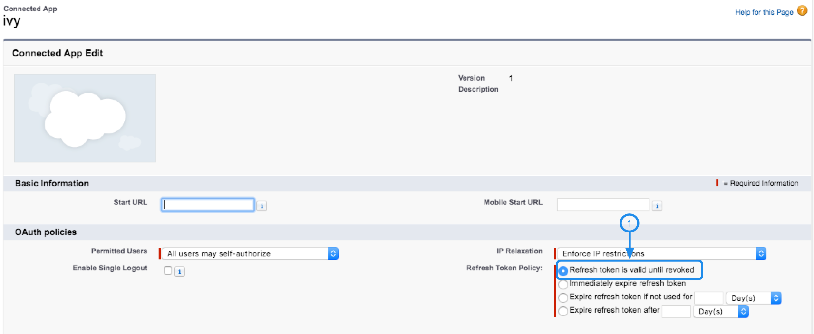

Connect with Salesforce
===================================

Introduction
------------

\
Step1: Find Client Id and Client Secret
----------------------------
Client Id and Client Secret are necessary for connecting your salesforce account with Ivy. This section will introduce you how to generate Client Id and Client Secret to grant Ivy authorization to connect with your salesforce account. 

* Set up Apps in Salesforce
    * Login to your Salesforce system: <a href="https://login.salesforce.com">Salesforce login page</a>
    * Click **"setup"** 
    * Then click **"setup"** on the drop down list
    

    * On the left sidebar, click **"Apps"** 
    * Then, click **"App Manager"**
    * Now click **"New Connected App"** on the right side

    

    * Fill below information into the form:
        >Contact App Name: Ivy  
        >API Name: Ivy  
        >Contact Email: support@ivy.ai  
    * Next, Select the **"Enable OAuth Settings"** 
    * Fill the **"Callback URL"** with:
        > https://bot.ivy.ai/admin/configuration/integration/salesforce/callback
    * Enable the following Scopes:
        >Access and manage your data (api)
        >Perform requests on your behalf at any time (refresh_token,offline_access)
        >Provide access to your data via the Web (web)

    
    
    * click **"Save"** it, then click **"Continue"**. Please be noticed that any changes you made will take 2-10 minutes to take effect on salesforce server.

    

* Generate Client Id and Client Secret
    * In the new page, the system generate **"Customer key"** and **"Customer Secret"** for future Api connection, please copy them and return to the ivy admin system

    

\
Step2: Set Refresh Policy
--------------
Before going back to the Ivy admin system, you need to set the refresh policy to make sure that Access can be automatically refreshed. 

* Go to Manage Connect Apps
    * Click **"Manage Connected Apps"** on the left sidebar
    * Then Find App "Ivy", click **"Edit"**
    
* Change Refresh Tooken Policy
    * select **"Refresh Token is valid until revoked"** as Refresh Token Policy
    * Save settings
    
    

